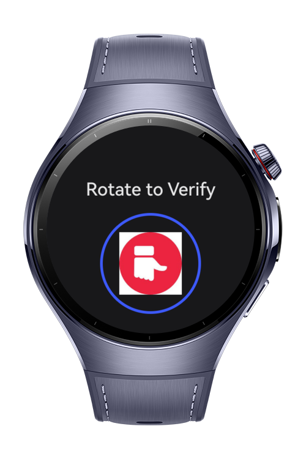

> **Note:** To access all shared projects, get information about environment setup, and view other guides, please visit [Explore-In-HMOS-Wearable Index](https://github.com/Explore-In-HMOS-Wearable/hmos-index).

# How To Add Rotating Verifier Action Before Opening an App

# Preview

<div>
  
  
  
  
 
</div>

# Use Cases
1. When the user opens the app, a rotating verification screen 	appears before accessing the main content.
2. User interacts with the verification dial.
3. If the user rotates the icon to the correct position (e.g., +90°), the app displays a “Verification successful” message.
4. After successful verification, the user is automatically redirected to the main page of the application.

# Technology

## Stack

- **Languages**: ArkTS, ArkUI
- **Frameworks**: HarmonyOS 6.0.0
- **Tools**: DevEco Studio Vers 6.0.0,
- **Libraries**: @ohos.display, @kit.ArkUI

# Directory Structure

```
entry
├───src
   └───main
       ├───ets
       │   └───pages
       │       └───index
       │               index.ets
       │
       └───resources
           └───base
              └───media
                      dislikeIcon.png                     
```

# Constraints and Restrictions

## Supported Devices

- Huawei Watch 5

# License

This project is distributed under the terms of the **MIT License**.
See the [LICENSE](LICENSE) for more information.


